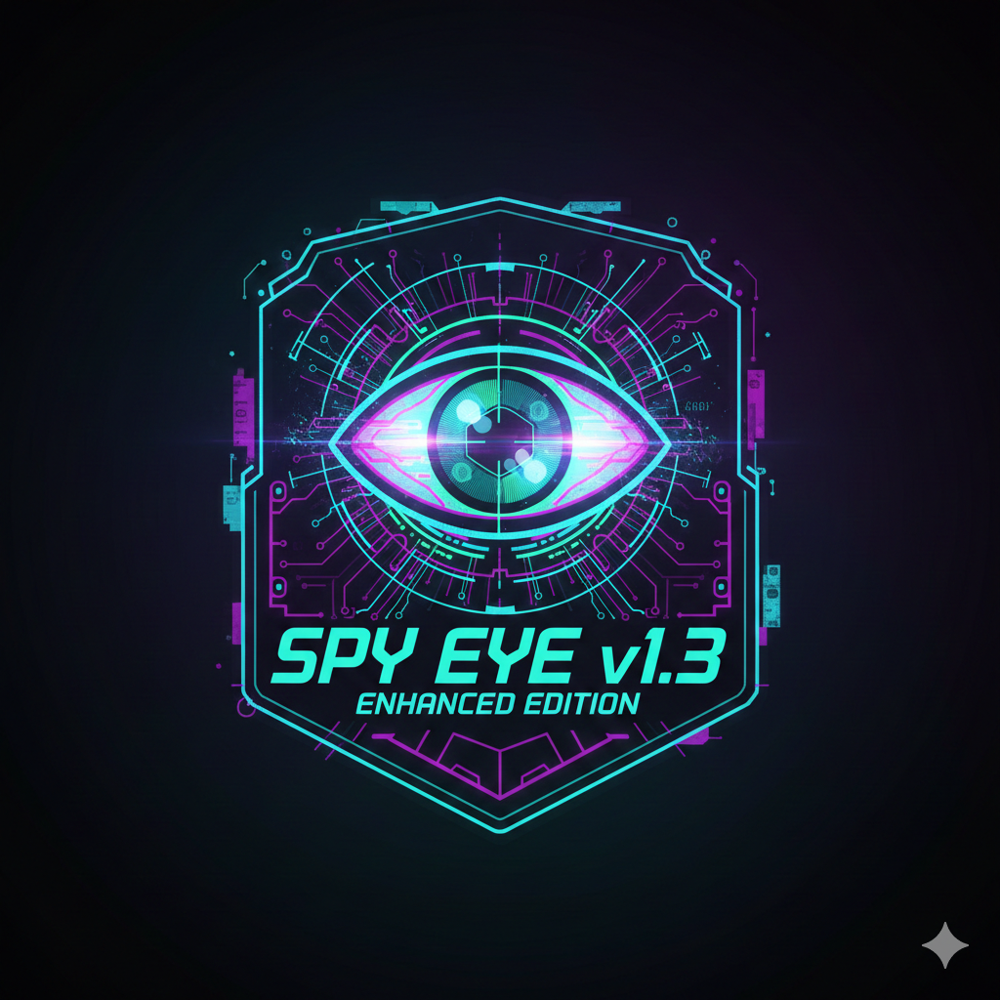

<a href="https://github.com/Athexhacker/spyeye"></a> 

# 🕵️ SPY EYE v1.3 - Enhanced Edition
A powerful reconnaissance and tracking tool for penetration testing and ethical hacking

![Geo-Phone] (https://img.shields.io/badge/SPY-EYE-red?style=for-the-badge)
https://img.shields.io/badge/Version-1.3_Enhanced-blue?style=for-the-badge
https://img.shields.io/badge/Platform-Linux-lightgrey?style=for-the-badge
https://img.shields.io/badge/License-MIT-green?style=for-the-badge

# 🌟 Overview
SPY EYE is an advanced reconnaissance tool designed for educational and authorized security testing purposes. It provides sophisticated target tracking, data collection, and GPS location capabilities with a stealthy approach and professional interface.

# What is SPY EYE ?
<p>SPY EYE is a tool that can remotely capture the exact GPS coordinates of a target device using a PHP server, and can also grab basic information about the system and ISP. This tool can be very helpful in information gathering. you can get following information of the target device</p>
<ul>
  <li>Longitude</li>
  <li>Latitude</li>
  <li>Device Model</li>
  <li>Operating System</li>
  <li>Number of CPU Cores</li>
  <li>Screen Resolution</li>
  <li>User agent</li>
  <li>Public IP Address</li>
  <li>Browser Name</li>
  <li>ISP Information</li>
</ul>

# ⚠️ DISCLAIMER: This tool is for educational purposes only. Use only on systems you own or have explicit permission to test. Unauthorized use is illegal.

# 🚀 Features
✅ Stealth Mode - Operates discreetly with minimal footprint

✅ Dual Tunneling - Cloudflare tunnel or local host options

✅ GPS & IP Tracking - Advanced geolocation capabilities

✅ Real-time Monitoring - Live data streaming of target activity

✅ Data Logging - Automatic IP/data storage with timestamps

✅ Cross-platform - Works on Linux, Android (Termux), macOS

✅ Color-coded UI - Professional terminal interface with animations

✅ Dependency Check - Auto-verification of required packages

# 🎨 User Interface
The tool features a visually engaging interface with:

ASCII art banner with color effects

Typewriter-style text animations

Pulsing text alerts for critical events

Spinner animations during operations

Color-coded status indicators

Real-time monitoring display

📦 Installation
Requirements
Linux-based OS (Ubuntu, Kali, Debian, Termux)

PHP 7.0 or higher

curl or wget

SSH (for certain features)

Quick Install
bash
# Clone the repository
```
git clone https://github.com/Athexhacker/spyeye.git
cd spyeye

# Make executable
chmod +x run.sh

# Run the tool
./run.sh
```
***Termux (Android) Installation***
```
pkg update && pkg upgrade
pkg install git php curl wget -y
git clone https://github.com/Athexhacker/spyeye.git
cd spyeye
chmod +x run.sh
./run.sh
🛠 Usage
Basic Usage
bash
./run.sh
```
# Tunneling Options
Cloudflare Tunnel (Recommended)

Generates a temporary .trycloudflare.com link

No port forwarding required

Works behind NAT/firewalls

Local Host

Uses local IP address

Requires port 8080 accessibility

For local network testing

# Workflow
text
1. Tool starts with system checks
2. Select tunneling method
3. Link generated for target
4. Monitor for target activity
5. Capture and log data
6. Real-time data stream display

